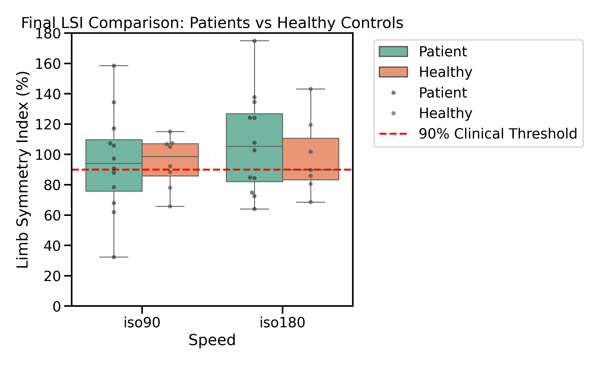

# ACL Recovery Analysis: Limb Symmetry Index (LSI) Study

## Project Description
This project focuses on analyzing the recovery progress of patients after **ACL reconstruction surgery**. I used Python to process raw biomechanical data from isokinetic dynamometers and wearable IMU sensors. 

The goal was to calculate the **Limb Symmetry Index (LSI)**, which is a critical clinical metric used to determine if an athlete is ready to return to sports.

## Tech Stack & Methods
* **Language:** Python
* **Libraries:** Pandas (Data manipulation), NumPy (Calculations), SciPy (Signal processing), Matplotlib & Seaborn (Visualization).
* **Signal Processing:** * Applied a **Butterworth Bandpass Filter** (20-450 Hz) to clean EMG signals.
    * Performed signal **Rectification and Normalization**.
    * Calculated **Area Under the Curve (AUC)** for precise symmetry comparison.

## Key Results
The analysis compares the LSI of patients against healthy controls at two different speeds: **iso90** and **iso180**. 
* A **90% Clinical Threshold** is highlighted as the benchmark for successful rehabilitation.

The data used in this project is sourced from:
*Dryad | Post-ACL reconstruction surgery rehabilitation dataset using isokinetic dynamometer and wearable IMUs.*
